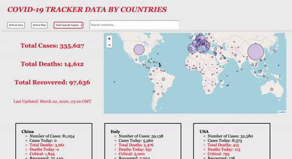
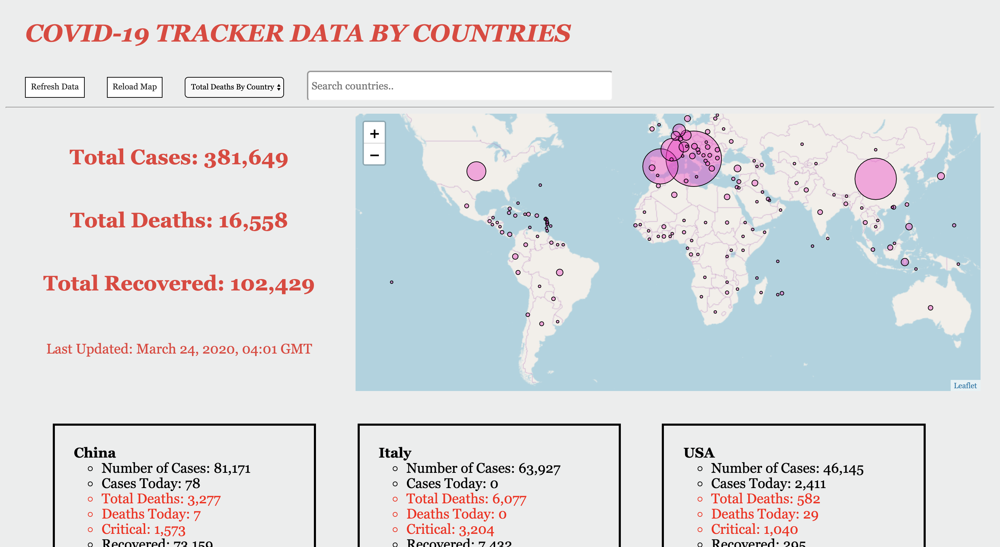

# COVID-19 Live Data Tracker by Country

A simple mobile-responsive app utilizing the COVID-19 API (https://coronavirus-19-api.herokuapp.com/all & https://coronavirus-19-api.herokuapp.com/countries) to display live information about COVID-19 globally & by country. World map displaying number of cases in each country made using mappa.js and p5.js. Simple search bar implementation to locate data by country.

The webpage can be found at https://brandonktran.github.io/COVID-19_Live_Data_Tracker/ (Use Chrome for best results). 

Some gifs to demonstrate the webpage:

  

