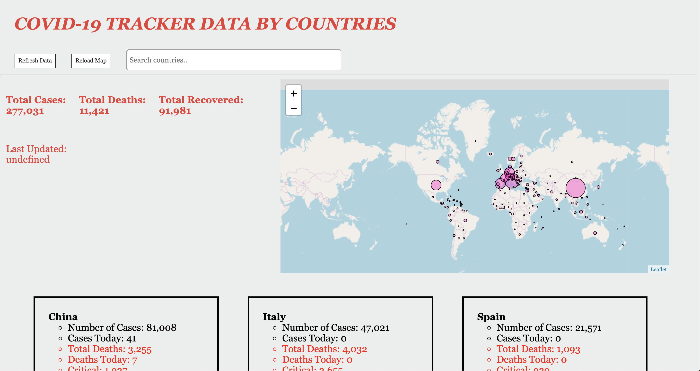
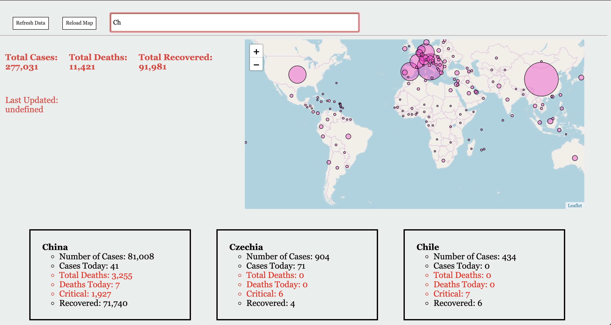

# COVID-19 Data Tracker by Country

A very simple UI utilizing the COVID-19 API (https://coronavirus-19-api.herokuapp.com/all & https://coronavirus-19-api.herokuapp.com/countries) to display live information about COVID-19 globally & by country. World map displaying number of cases in each country using mappa.js library and the p5.js library. Simple search bar implementation to locate data by country.

 

